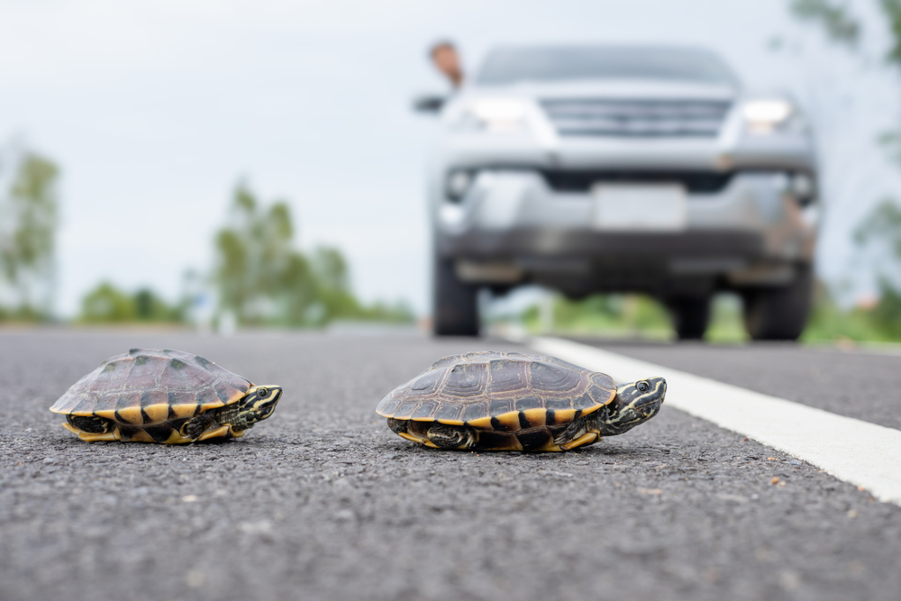

# <u>**Turtle Crossing Capstone Project**</u>

## User controlled turtle road crossing game  
The game has cars crossing from right to left of the screen and
the user has to move the turtle vertically from bottom to top of the screen.
Once it reaches the top of the screen, the turtle position will reset to the 
beginning of the line & the next level will start. With increase of each level,
the car speed is going to increase, and once the turtle hits a car, it's GAME 
OVER!  
 
   
### <u>**Libraries used:**</u>  
Turtle graphics  
### <u>**Project:**</u>  
Turtle Crossing Capstone Project 
100 Days of Code - The Complete Python Pro Bootcamp 2021  
Day 23 - Intermediate - The Turtle Crossing Capstone Project